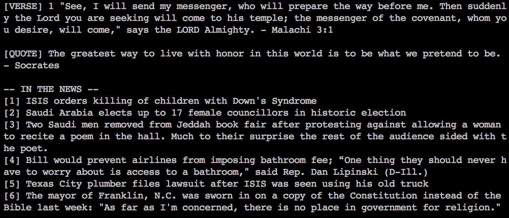

# #ROTD
ROTD is a python script which provides a recap of the day by web scraping various websites. The recap consists of a bible verse, an inspirational quote, and a mini RSS-feed displaying headlines of current news from [/r/news] and [/r/worldnews].
### Purpose
This script was designed to be run at the start of a terminal session to provide a composite information block from various websites.
* To stay up to date with current events and news
* To gain inspiration from various works and authors
* To minimize distraction time often experienced on a web browser

### Dependencies
ROTD uses these python libraries to work properly:
* [pickle] - Serialization of objects and working persistent data
* [BeautifulSoup] - HTML/XML parser for extracting data
* [webbrowser] - For opening links of news article in browser
### Usage
To avoid having to type the entire command to run the script, an alias is recommended.
```sh
$ alias dr='python rotd.py'       
$ dr
```

### Options
When the information block above is unwanted, the remove-all option should be used, or to revert back, the -reset option should be used. In order to sync news with the most current, the -sync-current-news option should be used. To open the news article in a web browser, the -open-link option should be used with the article number desired.
```
usage: rotd.py [-h] [-a] [-n] [-f] [-r] [-s] [-o OPEN_LINK]

Recap of the Day! #ROTD

optional arguments:
  -h, --help            show this help message and exit
  -a, --remove-all      hides all attributes
  -n, --news-remove     removes news from the recap data shown
  -f, --find-new-quote  finds new inspirational quote
  -r, --reset           reset all attributes to show again
  -s, --sync-current-news
                        fetches fresh news from /r/news and /r/worldnews
  -o OPEN_LINK, --open-link OPEN_LINK
                        opens new tab in browser with news article of choice
```
### Future features
 - Weather updates for the week
 - Additional reddit pages or news sites
 - Storing quotes/verses into database for future reference
 
[//]: # 
   [/r/news]: <http://www.redddit.com/r/news>
   [/r/worldnews]: <http://www.reddit.com/r/worldnews>
   [pickle]: <https://docs.python.org/2/library/pickle.html#module-pickle>
   [BeautifulSoup]: <http://www.crummy.com/software/BeautifulSoup/bs4/doc/>
   [webbrowser]: <https://docs.python.org/2/library/webbrowser.html>

  

